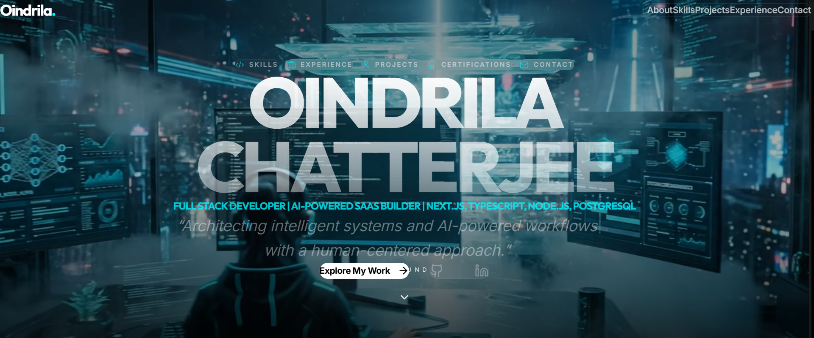
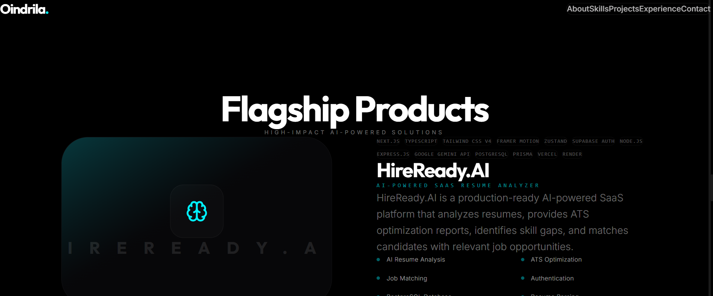

# Oindrila Chatterjee – Portfolio Website

🚀 Personal portfolio website showcasing my projects, AI-powered web applications, frontend development skills, and technical experience.

## 🌐 Live Website
[Visit Portfolio](https://oindrila-chatterjee.vercel.app/)

---

## 📌 About

This portfolio highlights my work in:
- AI-powered web applications
- Prompt engineering
- Frontend development
- Data analysis projects
- Generative AI integrations

Designed with a clean and responsive UI to provide recruiters and collaborators with an easy way to explore my projects and skills.

---

## ✨ Features

- Responsive modern UI
- Project showcase section
- AI & frontend focused portfolio
- GitHub and live project links
- Contact and social links
- Fast deployment using Vercel

---

## 🛠️ Tech Stack

- **Frontend:** Next.js, TypeScript, Tailwind CSS, Framer Motion, Zustand
- **Backend:** Node.js, Express.js, TypeScript
- **Database:** PostgreSQL, Prisma ORM, Supabase
- **Authentication:** Supabase Auth
- **AI:** Google Gemini API
- **Infrastructure:** Vercel, Render
- **Tools:** Git, GitHub, VS Code

---

## 📂 Featured Projects

### 🔹 HireReady AI
AI-powered ATS Resume Analyzer with personalized optimization suggestions.

### 🔹 AttireSense
AI-based fashion recommendation web application using Generative AI concepts.

### 🔹 Student Performance Analysis
Python-based data preprocessing and performance trend analysis project.

---

## 📸 Screenshots

